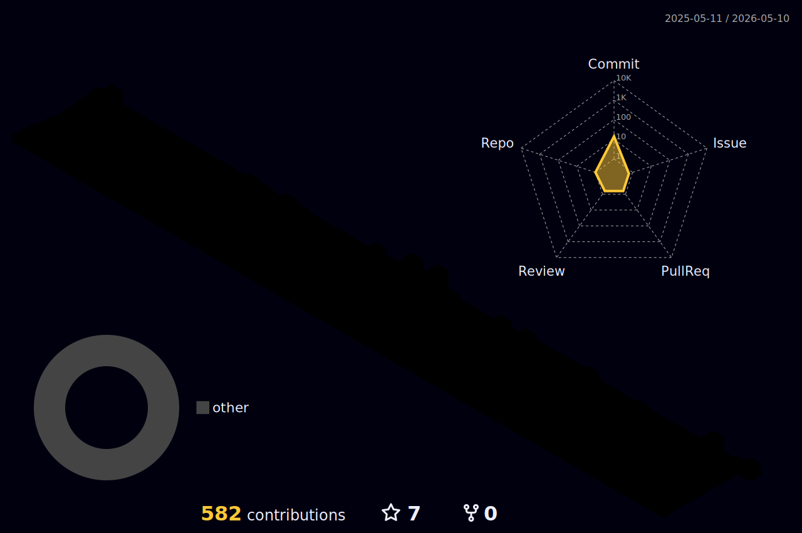

# Hi, I'm Aquib Moin 👋

### Master of Computer Applications | Full Stack Developer | Web3 Enthusiast

---

# 👨‍💻 About Me

💻 Full Stack Developer building **scalable SaaS platforms and Web3 applications**

🚀 Co-Founder at **Dura Mater Technologies**

⚡ Focus Areas

• Web3 & Blockchain
• SaaS Platforms
• Next.js Applications
• Backend Architecture

🎯 Currently Working On

• DeFi Hot Wallet
• NGO Donor Management System

---

# 💼 Professional Experience

## 🚀 Full Stack Developer — Dura Mater Technologies (2024–Present)

### DeFi Hot Wallet

• Multi-chain crypto wallet
• Ethereum ERC-20 and TRON TRC-20 support
• Secure private key storage
• Portfolio tracking

Tech

React Native • Web3.js • Ethers.js • Node.js

---

### Donor Management System

Platform helping NGOs manage donors and analytics.

Features

• Donor CRM
• Donation tracking
• Campaign reports
• Email notifications
• Analytics dashboard

Tech

Next.js • Node.js • MongoDB • Tailwind

---

## 💾 Database Developer — TradesTeam (UK)

• Database schema design
• API integration with ServiceM8
• JSON data handling
• Query optimization

---

## 💻 Software Engineer — ColoredCow

Projects

• Pathways
• Lighthouse Delhi 3.0

Responsibilities

• Database architecture
• PowerBI integration
• Azure deployments
• Data automation

---

# 🎓 Education

### 🎓 Master of Computer Applications

Central University of Haryana

### 🎓 Bachelor of Computer Applications

Birla Institute of Technology Mesra

---

# 🛠 Tech Stack

---

# 🚀 Featured Projects

### 💰 DeFi Hot Wallet

Secure multi-chain crypto wallet.

Tech

React Native • Web3.js • Node.js

---

### ❤️ Donor Management Platform

Modern SaaS for NGOs.

Tech

Next.js • Node.js • MongoDB

---

# 📊 GitHub Stats

---

# 📈 GitHub Activity

---

# 🐍 Contribution Snake

---

# 🌌 3D Contribution Graph

---

# 🧠 Achievements

🏆 AIR 23 — ICAR-JRF (Computer Applications & IT)

📊 Integrated PowerBI dashboards into production systems

❤️ Certificate from Delhi State AIDS Control Society

---

# ✍️ Blog

I write technical articles on Medium.

• AWS CloudHSM Implementation
• AWS IoT Device Management
• PowerBI Integration in Web Apps

👉 https://medium.com/@aquibmoin786

---

# 🤝 Connect

---

⭐️ From **Aquib Moin**

