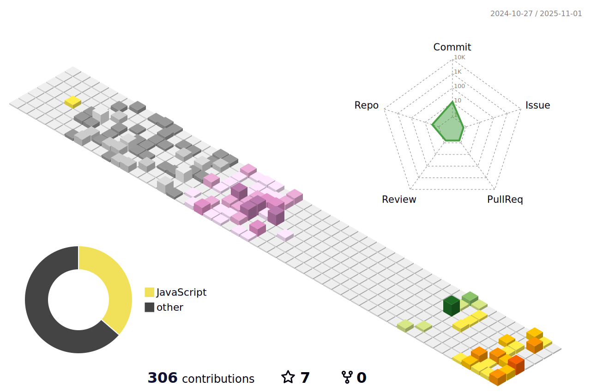

# Hi, I'm Aquib Moin 👋

Welcome to my GitHub profile!

I'm a developer passionate about open source, web development, and learning new technologies.

📊 GitHub Contributions:

  <!-- Background Image (Optional: keep or replace) -->
  

  <!-- Social Media Buttons -->
  

    
    
    
    
    
    
  

### Glad to see you here ❤️

  

 

## 💼 Professional Experience

<!-- (Keep your existing table) -->
<table>
  <tr>
    <td style="padding: 20px; border: 1px solid #ddd; border-radius: 5px; vertical-align: top;">
      <h3>Co-Founder</h3>
      
🢠Dura Mater Technologies Pvt Ltd

      
📅 Jan 2024 - Present

    </td>
  </tr>
  <tr>
    <td style="padding: 20px; border: 1px solid #ddd; border-radius: 5px; vertical-align: top;">
      <h3>Database Developer</h3>
      
🢠TradesTeam, Preston, UK

      
📅 1 Oct 2023 - 31 Dec 2023

      
Key Responsibilities:

      <ul>
        <li>Develop Database schemas, Tables</li>
        <li>API call from Frontend to ServiceM8 for Post and Get JSON data</li>
      </ul>
    </td>
  </tr>
  <tr>
    <td style="padding: 20px; border: 1px solid #ddd; border-radius: 5px; vertical-align: top;">
      <h3>Software Developer Engineer</h3>
      
🢠ColoredCow Pvt Ltd

      
📅 01 July 2021 – 31 July 2023

      
Key Responsibilities:

      <ul>
        <li>Develop database schemas, tables and Stored Procedure</li>
        <li>Fix database performance issues</li>
        <li>Test databases and perform bug fixes</li>
        <li>PowerBI Graph integration into WebApp</li>
        <li>Set up Google Apps Script API calls</li>
        <li>Staging and production deployment</li>
      </ul>
    </td>
  </tr>
  <tr>
    <td style="padding: 20px; border: 1px solid #ddd; border-radius: 5px; vertical-align: top;">
      <h3>Software Developer Intern</h3>
      
🢠Credence Analytics Pvt Ltd

      
📅 01 June 2021 – 30 Nov 2021

      
Key Responsibilities:

      <ul>
        <li>Extract CSV data of NSE and BSE into database</li>
      </ul>
    </td>
  </tr>
</table>

 

## 🎓 Education

<table>
  <tr>
    <td style="padding: 20px; border: 1px solid #ddd; border-radius: 5px; vertical-align: top;">
      <h3>Master of Computer Applications</h3>
      
🏛️ Central University of Haryana

      
📅 2018 - 2021

      
📊 Grade: First Class

    </td>
    <td style="padding: 20px; border: 1px solid #ddd; border-radius: 5px; vertical-align: top;">
      <h3>Bachelor of Computer Applications</h3>
      
🏛️ Birla Institute of Technologies Mesra, Ranchi

      
📅 2014 - 2017

      
📊 Grade: First Class with Distinction

    </td>
  </tr>
</table>

 

## 🏆 Certifications

<table>
  <tr>
    <td style="padding: 20px; border: 1px solid #ddd; border-radius: 5px; vertical-align: top; text-align: center;">
      <h3><a href="https://www.hackerrank.com/certificates/aa47b6b06074" target="_blank">SQL (Advanced)</a></h3>
      
📅 2 Aug 2023

      <a href="https://www.hackerrank.com/certificates/aa47b6b06074" target="_blank">
        
🏛️ HackerRank

      </a>
    </td>
    <td style="padding: 20px; border: 1px solid #ddd; border-radius: 5px; vertical-align: top; text-align: center;">
      <h3><a href="https://www.hackerrank.com/certificates/ba257d0a711e" target="_blank">SQL (Intermediate)</a></h3>
      
📅 2 Aug 2023

      <a href="https://www.hackerrank.com/certificates/ba257d0a711e" target="_blank">
        
🏛️ HackerRank

      </a>
    </td>
    <td style="padding: 20px; border: 1px solid #ddd; border-radius: 5px; vertical-align: top; text-align: center;">
      <h3><a href="https://www.hackerrank.com/certificates/ba82842b713d" target="_blank">SQL (Basic)</a></h3>
      
📅 2 Aug 2023

      <a href="https://www.hackerrank.com/certificates/ba82842b713d" target="_blank">
        
🏛️ HackerRank

      </a>
    </td>
    <td style="padding: 20px; border: 1px solid #ddd; border-radius: 5px; vertical-align: top; text-align: center;">
      <h3><a href="https://jovian.ai/certificate/MFQTINJVHE" target="_blank">Data Analysis with Python</a></h3>
      
📅 2 Aug 2023

      <a href="https://jovian.ai/certificate/MFQTINJVHE" target="_blank">
        
🏛️ Jovian

      </a>
    </td>
  </tr>
</table>

 

# Blog Posts

<table style="width: 100%; border-collapse: collapse;">
  <tr>
    <td style="padding: 20px; border: 1px solid #ddd; border-radius: 5px; vertical-align: top; text-align: center;">
      <h5><a href="https://medium.com/@aquibmoin786/aws-cloudhsm-implementation-e24c724259fa" style="color: #333;">AWS CloudHSM Implementation</a></h5>
      
    </td>
    <td style="padding: 20px; border: 1px solid #ddd; border-radius: 5px; vertical-align: top; text-align: center;">
      <h5><a href="https://medium.com/@aquibmoin786/aws-iot-device-management-6bc79817be0b" style="color: #333;">AWS IoT Device Management</a></h5>
      
    </td>
    <td style="padding: 20px; border: 1px solid #ddd; border-radius: 5px; vertical-align: top; text-align: center;">
      <h5><a href="https://medium.com/@aquibmoin786/aws-iot-button-for-home-automation-9e11ac68f63c" style="color: #333;">AWS IoT Button for Home Automation</a></h5>
      
    </td>
    <td style="padding: 20px; border: 1px solid #ddd; border-radius: 5px; vertical-align: top; text-align: center;">
      <h5><a href="https://medium.com/@aquibmoin786/powerbi-graphs-integrate-into-a-web-app-without-requiring-a-login-c15a7c978eba" style="color: #333;">PowerBI in Web App (No Login)</a></h5>
      
    </td>
  </tr>
</table>

 

## GitHub Activity

 

## My Skill Set  
<!-- (Keep your existing skill table) -->
<table><tr><td valign="top" width="25%">
  ### Frontend  
  
  
      
      
      
      
      
    
      
  

</td><td valign="top" width="25%">
  ### Backend  
  
  
    
    
    
  

</td><td valign="top" width="25%">
  ### Database  
  
  
    
    
    
  

</td><td valign="top" width="25%"> 
  ### Others  
  

    
    
    
    
    
    
    
    
  

</td></tr></table>

 

<h2>📊 GitHub Stats</h2>

  
  &nbsp;&nbsp;
  

